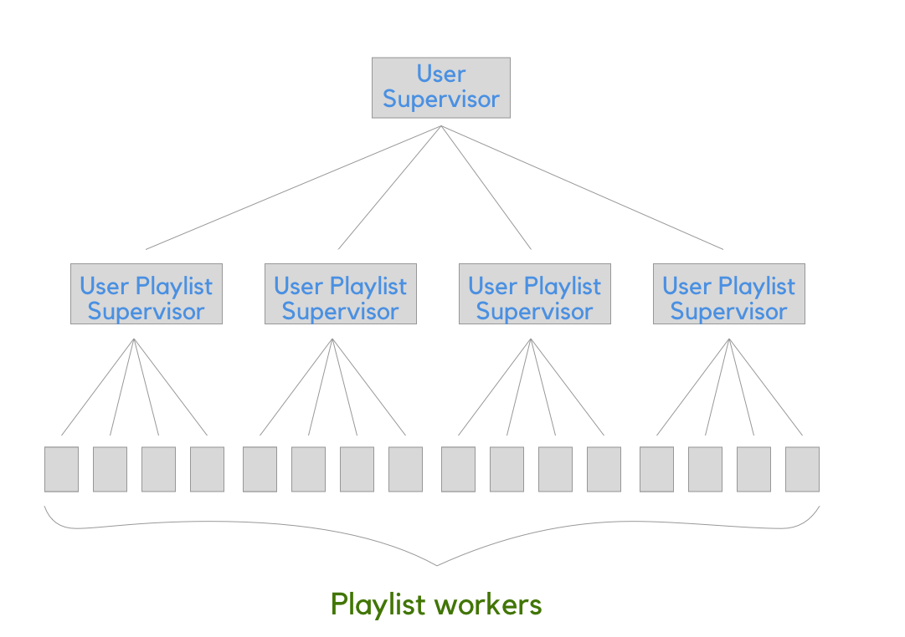

Name: Zach Banducci          ID: 44671228

## Proposed Project

A random Spotify playlist generator that curates playlists created by your friends based on your music taste. Spotify offers a web API that would allow me to get playlists created by specific users along with the artists that they listen to. By examining your most listened to songs and artists that you listen to and comparing that to your friends' playlists, the generator would be able to curate suggested playlists for you to follow. 

## Outline Structure

First, a user's music taste needs to be examined and that data is stored in a local database. Then, I would be able to start examining the playlists of all of the people that a specific user follows. This project is the perfect playground for processes and supervisors. There can be a user supervisor that manages followed user supervisors. Each followed user supervisor also spawns a worker that examines a playlist of a given user. 

My goal is to use the Phoenix framework and utilize the server side rendering. If I have the time, I would like to plug some React components in the the application. 
